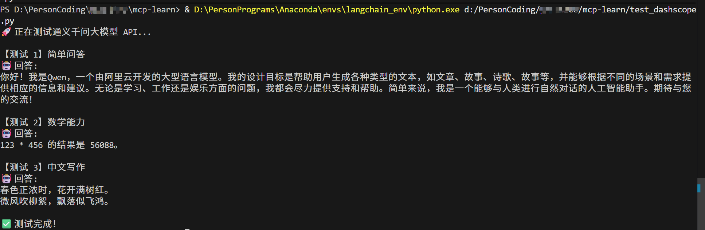
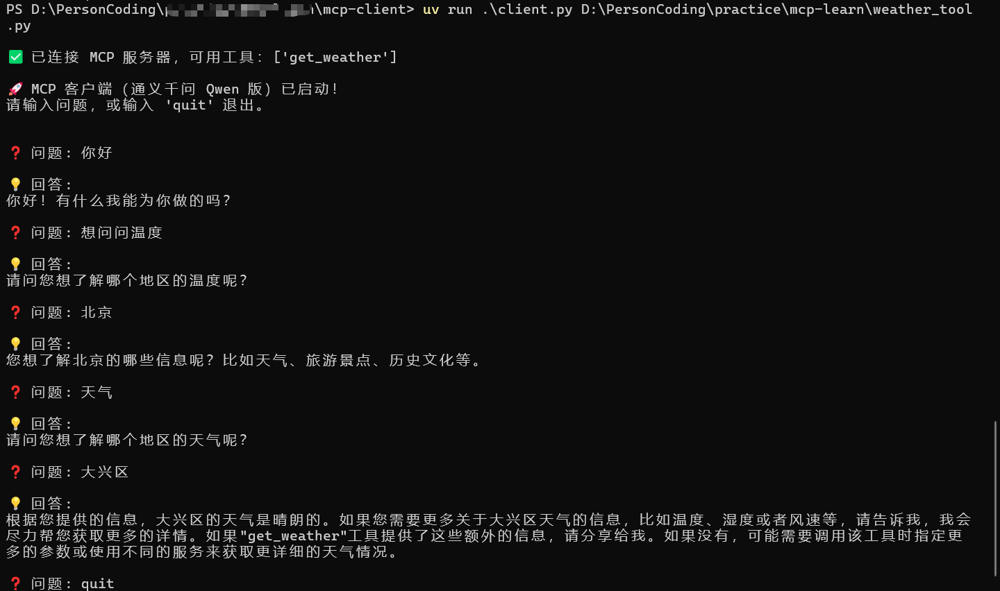

* 千问 API Key 及模型调用测试图：

* MCP客户端搭建测试图：



#### MCP windows 客户端搭建
1. 在powershell中运行以下命令:
```
# 安装uv
> powershell -ExecutionPolicy Bypass -c "irm https://github.com/astral-sh/uv/releases/download/0.9.27/uv-installer.ps1 | iex"

> uv --version
uv 0.9.27 (b5797b2ab 2026-01-26)

> mkdir mcp-client 
> cd mcp-client

# 初始化虚拟环境（uv 自动创建）
> uv init 

#创建虚拟环境
> uv venv

#激活虚拟环境
#Windows系统:
> .venv\Scripts\activate
# UNIX或macOS:
> source .venv/bin/activate

#删除模板文件
> rm main.py

#创建客户端主文件
> touch client.py

> uv add "mcp[cli]"
> uv pip install dashscope
> uv pip install mcp-server

# 显示mcp版本
> uv pip show mcp

# 启动服务器
(mcp-client) PS D:\PersonCoding\practice\mcp-learn\mcp-client> python ..\weather_tool.py

# 运行客户端
(mcp-client) PS D:\PersonCoding\practice\mcp-learn*\mcp-client> uv run .\client.py D:\PersonCoding\practice\mcp-learn\weather_tool.py       
```
2. 如果mcp包安装失败，可以按如下方式处理
```
# 请手动删除以下uv初始化项目中的mcp目录（如果存在）：
D:\PersonCoding\practice\mcp-learn\mcp-client\.venv\Lib\site-packages\mcp\
D:\PersonCoding\practice\mcp-learn\mcp-client\.venv\Lib\site-packages\mcp-*.dist-info\

# 卸载旧包（去掉 -y）
uv pip uninstall mcp mcp-server mcp-client

# 安装最新官方 mcp（包含 client + server）
> uv add "mcp[cli]"

```

#### MCP Linux 客户端搭建
```
$ node -v
v22.17.0
$ npm -v
10.9.2
# 安装 uv（推荐方式）
$ curl -LsSf https://astral.sh/uv/install.sh | sh
$ uv --version
uv 0.9.26

$ mkdir mcp-client
$ cd mcp-client/
$ uv init
Initialized project `mcp-client`

# uv 支持自动下载预编译的 Python 版本（类似 pyenv，但更快）
(mcp-client)$ uv venv --python 3.11
Using CPython 3.11.0 interpreter at: /usr/local/bin/python3.11
Creating virtual environment at: .venv
Activate with: source .venv/bin/activate

$ source .venv/bin/activate
(mcp-client)$ python --version
Python 3.11.0

# 查找系统中可用的 Python 3.11
$ uv python list
# 假设输出中有：
#   3.11.0    /home/deploy/.pyenv/versions/3.11.0/bin/python

# uv run默认使用系统或 Anaconda 的 base Python（3.9.12），而不是你当前激活的 Python 3.11！
# 强制指定使用 3.11（会生成新的 .python-version）：✅ 这会在项目根目录创建 .python-version 文件，内容为 3.11，告诉 uv：“请用 3.11”
uv python pin 3.11

# 清理旧环境
rm -rf .venv

# 同步（现在会用 Python 3.11）
uv sync

$ uv pip install "mcp[cli]"
$ uv add anthropic python-dotenv dashscope
$ uv pip install mcp-server

# 服务器运行
$ python weather_tool.py 
# 客户端运行
$ uv run client.py ~/mcp_learning/mcp-client/weather_tool.py 
```